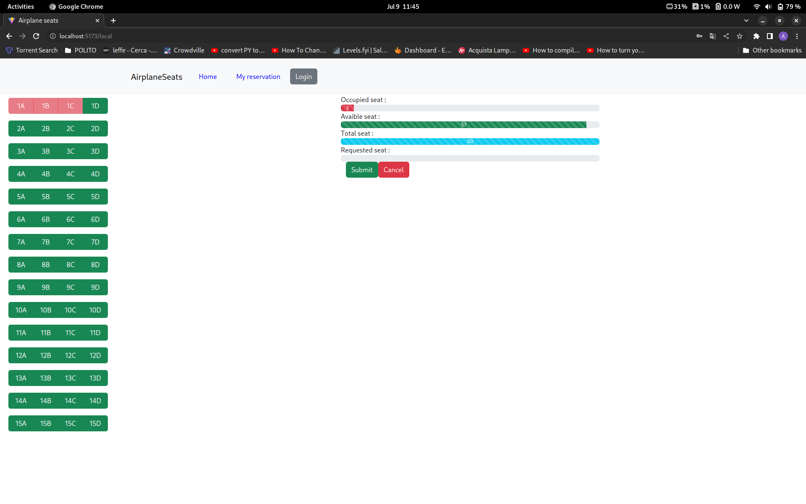

[](https://classroom.github.com/a/TsciYmrA)
# Exam #2: "Airplane Seats"
## Student: s317748 IORIO ANTONIO 

## React Client Application Routes

- Route `/`: this is homepage and it gives the possibility to choose a plane type to book
- Route `/local`: page content seat information and possibility to reserve seats in a local plane if they are avaible
- Route `/regional`: page content seat information and possibility to reserve seats in a regional plane if they are avaible
- Route `/international`: page content seat information and possibility to reserve seats in a international plane if they are avaible
- Route `/login`: page where user can do login
- Route `/reservation`: shows reservation of a specific user, but he must be logged

## API Server
- __GET__ `/api/local` - get information about the seats, if available or not, of a local plane. 
  - Response Status : `200` OK, `500` Internal Server Error
  - Response Body :
  ```
    [
      {
        "Id": 1,
        "A": 1,
        "B": 1,
        "C": 1,
        "D": 0
      },
      {
        "Id": 2,
        "A": 0,
        "B": 0,
        "C": 0,
        "D": 0
      },
      {...}
    ]
  ```  

- __GET__ `/api/regional` - get information about the seats, if available or not, of a regional plane. 
  - Response Status : `200` OK, `500` Internal Server Error
  - Response Body :
  ```
    [
      {
        "Id": 1,
        "A": 0,
        "B": 1,
        "C": 1,
        "D": 0,
        "E": 0
      },
      {
        "Id": 2,
        "A": 1,
        "B": 0,
        "C": 0,
        "D": 0,
        "E": 0
      },
      {...}
    ]
  ```

- __GET__ `/api/international` - get information about the seats, if available or not, of a international plane. 
  - Response Status : `200` OK, `500` Internal Server Error
  - Response Body :
  ```
    [
      {
        "Id": 1,
        "A": 0,
        "B": 0,
        "C": 0,
        "D": 0,
        "E": 1,
        "F": 1
      },
      {
        "Id": 2,
        "A": 0,
        "B": 0,
        "C": 0,
        "D": 0,
        "E": 0,
        "F": 0
      },
      {...}
    ]
  ```

- __GET__ `/api/bookings/:IdUser` - get the type of plane where IdUser has a reservation
  - Prerequisite: User is logged in 
  - Response Status : `200` OK, `500` Internal Server Error
  - Response Body : 
  ```
    [
      "local",
      "regional"
    ]
  ```

- __POST__ `/api/bookings`- to do a reservation on a specific plane
  - Prerequisite: User is logged in
  - Request body:
  ```
    {
      "IdUser": Int - IdUser,
      "PlaneType": String - (local/regional/international),
      "Seats": [
        {
          "Id": Int - Number row of seat,
          "Column": String - Letter of seat
        },
        {...}
      ]
    }
    ```
  - Response Status : `201` Created, `304` Not Modified, `400` Bad request in db, `500` Internal Server Error
  - Response Body : 
  ```
    {"Message" : "Booked successfully"}
  ```
- __DELETE__ `/api/bookings` - to delete a reservation on a specific plane
  - Prerequisite: User is logged in
  - Request body:
  ```
    {
      "IdUser": Int - IdUser,
      "PlaneType": String - (local/regional/international),
    }
  ```
  -Response Status : `200` Ok, `304` Not Modified, `400` Bad request in db, `503` Service Unavailable
  -Response Body : 
  ```
    {"message" : "deleted with success"}
  ```

### User login
- __POST__ `/api/sessions`
  - Method: POST
  - Description: logs the user in, checking provided credentials
  - Request body: an object containing the credentials provided by the login form
    ```
    {
      "username":"antonio@polito.it",
      "password":"12345678"
    }
    ```
  - Response: `200 Ok` (if successful),  `401 Unauthorized` (login error)
  - Response body: some info on the logged user
    ```
    {
      "id":1,
      "name":"antonio",
      "email":"antonio@polito.it"
    }
    ```
    
### User logout
- URL: '/api/sessions/current'
  - Method: DELETE
  - Description: logs the user out, deleting the session
  - Request body: _None_
  - Response: `200 Ok`
  - Response body: _None_

### Check login
- URL: '/api/sessions/current'
  - Method: GET
  - Description: check whether the user is logged in or not
  - Request body: _None_
  - Response: `200 Ok` (if successul), `401 Unauthorized` (if not logged in)
  - Response body: some info on the logged user
      ```
      {
        "id":1,
        "name":"antonio",
        "email":"antonio@polito.it"
      }
      ```

## Database Tables

- Table `Bookings` - contains information about bookings
- Table `International` - contains information about seats of international plane
- Table `Local` - contain information about seats of local plane
- Table `Regional` - contain information about seats of regional plane
- Table `User` - contains information about user

## Main React Components

### Seats.jsx
- `Seats`: renders the page to show the seats reserved or not of plane

### AuthComponent.jsx
- `Login`: contains info to do login

### LoginComponent.jsx
- `LoginForm` : renders the page to insert e-mail and password to perform login

### MainPageComponent.jsx
- `MainPage` : contain all information to render the main page

### MyReservationComponent
- `ReservationComponent` : render the page where reservations of a specific user are seen

### NavBarComponent.jsx
- `NavBar` : renders the navbar and the icons at the top of the page

## Screenshot



## Users Credentials

- antonio@polito.it, 12345678 (has reservartion in local: 1A, 1B, 1C and in regional : 2A, 3A)
- marco@polito.it, 12345678 (has reservation in regional: 1B, 1C and in international: 1E, 1F)
- paolo@polito.it, 12345678 (no reservation)
- matteo@polito.it, 12345678 (no reservation)

